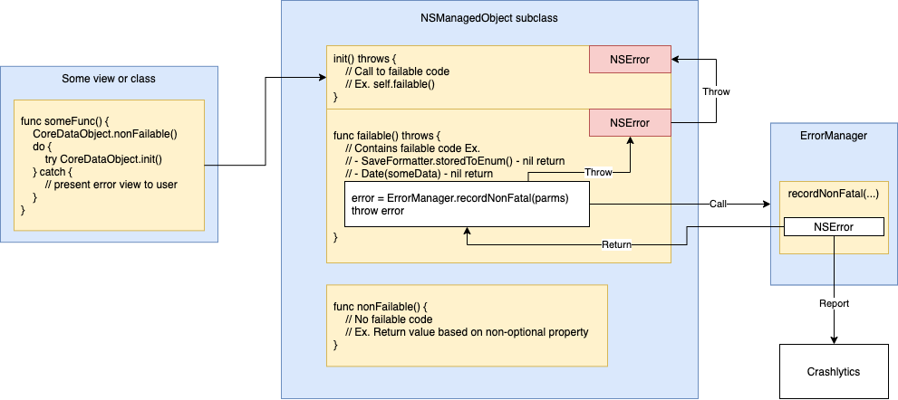

# Failure Handling and Error Reporting
Mu uses Firebase Crashlytics to report exceptions. More information on Crashlytics can be found [here](https://firebase.google.com/docs/crashlytics/customize-crash-reports). Although Crashlytics allows applications to report both fatal and non-fatal errors, Mu's error reporting and handling architecture is designed such that fatal errors are __NEVER__ issued.  
This document describes the development guidelines that are adhered to in handling failures and (if necessary) reporting non-fatal errors.  
The following definitions are used as such throughout the document:  
* __Failure__: A code execution that has resulted in an error that cannot be corrected by user action.
* __Failable function__: A function that
    * Contains a possible failure OR
    * Calls a function that contains a possible failure.

# Table of Contents
1. [Failure handling](#failure-handling)
    * [Returning optionals](#returning-optionals)
    * [Throwing functions](#throwing-functions)
        * [Throwing in model components](#throwing-in-model-components)
1. [Error reporting](#error-reporting)
    * [Base debug objects](#base-debug-objects)
1. [Crashlytics configurations](#crashlytics-configurations-and-projects)
1. [Build versioning](#build-versioning)

# Failure handling
In Mu, all failures are [reported to Crashlytics](#error-reporting) and handled by view components.  
The following table and sections detail how view components detect failures and which components/functions are responsible for reporting to Crashlytics.
| How view component detects failure | Component/function responsible for reporting |
|-|-|
| [Receives nil return value when expecting non-nil](#returning-optionals) | View component |
| [Catches error](#throwing-functions) | Function that first detected failure and threw error |

## Returning optionals
Failable functions return optionals when there is one (and only one) possible reason of failure.  
__Ex.__ Functions named `storedTo*()` in `SaveFormatter` return optionals - the only reason for failure is that the provided save-format value could not be converted to a valid `SaveFormatter` enum.

The following figure illustrates how view components handle optional returns and report errors to Crashlytics.

## Throwing functions
Failable functions throw if either of the following are true:  
1. There are multiple possible reasons for failure.  
__Ex.__ `Task.generateAndPruneInstances()` includes code with several possible reasons for failure. These include:
    * Finding persistent store data that violates business logic (A relationship that should be non-nil is nil)
    * Failing to convert persistent store data to valid in-memory value via `SaveFormatter` (corrupted data)
    * Swift's `Date` conversion/incrementation functions returns nil un-expectedly.
1. The function is defined in a model component (See [throwing in model components](#throwing-in-model-components)).

The following figure illustrates how errors that are reported to Crashlytics are thrown to view components to handle.

### Throwing in model components
To simplify failure detection in model components, Mu requires that all failable functions in model components be defined as throwing functions (including initializers).  
Thus, when a component calls a throwing Core Data function, it is expected to either
1. (If view component) Handle the error OR
1. Re-throw error for view component to handle.

# Error reporting
Based on the error reporting responsibility defined in [failure handling](#failure-handling), errors are reported to Crashlytics by completing the following steps:  
1. Record a non-fatal error via `ErrorManager` and include [base objects](#base-debug-objects) (if applicable) in the error's userInfo.
1. (If applicable) Throw the NSError returned by `ErrorManager` back down the call stack to be handled by view components. __ALL__ Errors that Mu throws are obtained from calling `ErrorManager`.  

## Base debug objects
When a failure occurs in a model component, error reporting, in addition to reporting debug data that is relevant to the failure, uses APIs provided by certain model components (base objects) to report an additional set of standard debug data.  
If the base debug object is unavailable (ex. failure occurs in a model component initializer), as much debug data is reported as possible/needed.
The following table specifies base objects for each of Mu's model components.
| Model component | Is base object? | Base debug object |
|-|-|-|
| Task | Y | N/A |
| Analysis | Y | N/A |
| Tag | N | None |
| TaskInstance | N | Task |
| TaskTargetSet | N | Task |
| TaskSummaryAnalysis | N | Task |
| LegendEntry | N | Analysis |
| DayPattern | N | Task |

# Crashlytics configurations and projects
In order to separate testing and release data, Mu uses the following build phases and configurations to capture data in 2 separate Firebase applications:  
1. The `Copy Bundle Resources` build phase copies both plists for the 2 Firebase applications to the built product bundle.
1. The `Update GoogleService-Info.plist` build phase copies and renames the appropriate Firebase plist to `GoogleService-Info.plist` in the built bundle. The resulting `.app` reports data to Firebase based on the following:  
    * Builds that use `GoogleService-Info-Debug.plist` report to Firebase application `Leko-Mu-Debug`
    * Builds that use `GoogleService-Info-Release.plist` report to Firebase application `Leko-Mu`

# Build versioning
To ensure that reported errors and crashes can be correlated back to the exact source code version, Mu follows a process of versioning builds based on [Twitch's iOS versioning practices](https://blog.twitch.tv/en/2016/09/20/ios-versioning-89e02f0a5146/).
Mu generates and updates the app's build version everytime the project is archived for distribution. This is achieved by the following build phases, targets, scripts, and configurations:  
1. Mu preprocesses `Info.plist` by defining the following project-wide build settings:
    * `INFOPLIST_PREFIX_HEADER` = `${PROJECT_DIR}/Versions/versions.h`
    * `INFOPLIST_PREPROCESS` = `Yes`
1. Mu's `Info.plist` sets the property `CFBundleVersion` to value `MuBuildNumber` (to be preprocessed).
1. Mu's target dependency `Versions` is built before Mu is. `Versions` contains the `Update build versions` run script phase, which generates a `versions.h` header file.
    * The `versions.h` contains a single preprocessor directive that defines the token `MuBuildNumber`, thus keeping up to date the `Info.plist` distributed with Mu. `MuBuildNumber` is generated by concatenating the short commit version of the current branch's tip, `.`, and the current epoch in minutes.

__Note__
* XCode actions using the `Debug` build configuration have, at times, not updated the Version number (unless a full clean and rebuild is executed). The exact issue and solution has not been found. The following (potential) workarounds are recommended to have the `Debug` build configuration generate a new version number for each build:  
    * In your machine's XCode developer dir, delete the `DerivedData` dir.
* For builds that use the `Release` configuration, the `Check Git changes` build phase of `Versions` is used to verify that the current branch is up-to-date with and tracking `origin/master`, with no merge conflicts or uncommitted changes.