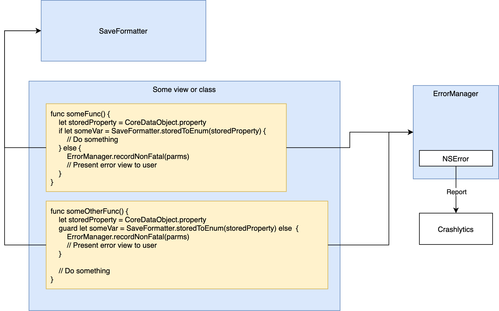
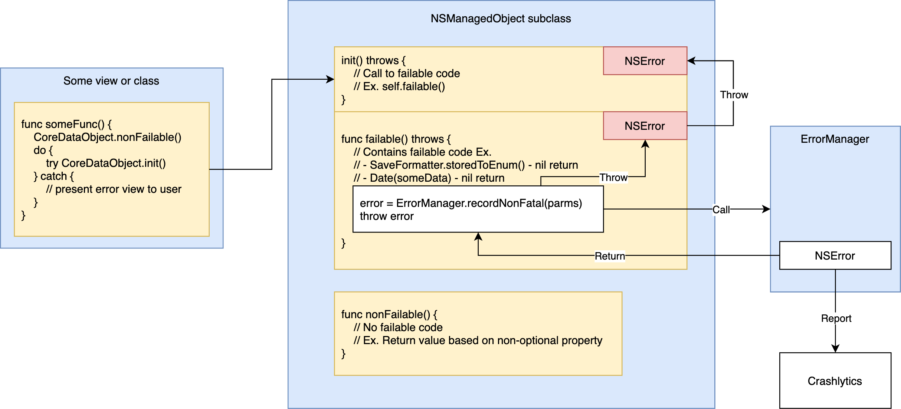

# Error Reporting and Failure Handling
Mu uses Firebase Crashlytics to report exceptions. More information on Crashlytics can be found [here](https://firebase.google.com/docs/crashlytics/customize-crash-reports). Although Crashlytics allows applications to report both fatal and non-fatal errors, Mu's error reporting and handling architecture is designed such that fatal errors should __NEVER__ be issued.  
This document describes the development guidelines that must be adhered to in handling failures and (if necessary) reporting non-fatal errors.  
The following definitions are used as such throughout the document:  
* `Failure condition`: A code path that can potentially encounter an error that cannot be corrected by user action.
* `Failure`: An execution of a failure condition that has resulted in an error that cannot be corrected by user action.
* `Failable function`: A function that
    * Contains a failure condition OR
    * Calls a function that contains a failure condition.

# Table of Contents
1. [Failure handling](#failure-handling)
    * [Returning optionals](#returning-optionals)
    * [Throwing functions](#throwing-functions)
        * [Throwing in Core Data](#throwing-in-core-data-apis)
1. [Error reporting](#error-reporting)
    * [Base debug objects](#base-debug-objects)
1. [Crashlytics configurations](#crashlytics-configurations)
1. [Build versioning](#build-versioning)

# Failure handling
In Mu, all failures must be handled by the UI and [reported to Crashlytics](#error-reporting).  
The following table specifies how the UI can be notified of failures in other parts of Mu and which object/struct is responsible for reporting to Crashlytics.
| How UI is notified of failure | Object/struct responsible for reporting |
|-|-|
| [Receives nil return value when expecting non-nil](#returning-optionals) | UI |
| [Catches error](#throwing-functions) | Function that first detected failure and threw error |

## Returning optionals
Failable functions should only return optionals when there is one (and only one) possible reason of failure.  
__Ex.__ Functions named `storedTo*()` in `SaveFormatter` return optionals - the only reason for failure is that the provided save-format value could not be converted to a valid in-memory enum/struct.

The following figure illustrates how Views handle optional returns and report errors to Crashlytics.

## Throwing functions
Failable functions should throw if either of the following are true:  
1. There are multiple possible reasons for failure.  
__Ex.__ `Task.generateAndPruneInstances()` includes code with several possible reasons for failure. These include:
    * Finding persistent store data that violates business logic (A relationship that should be non-nil is nil)
    * Failing to convert persistent store data to valid in-memory value via `SaveFormatter` (corrupted data)
    * Swift's `Date` conversion/incrementation functions returns nil un-expectedly.
1. Function is defined in an NSManagedObject subclass (See [throwing in Core Data](#throwing-in-core-data-apis)).

The following figure illustrates how errors that are reported to Crashlytics are thrown to the UI to handle.

### Throwing in Core Data APIs
To simplify failure detection in NSManagedObject subclasses, Mu requires that all failable functions in NSManagedObject subclasses be defined as throwing functions (including initializers).  
Thus, when a function calls a throwing Core Data function, it is expected to either
* (If UI) Handle the error OR
* Re-throw error for UI to handle.

# Error reporting
Based on the error reporting responsibility defined in [failure handling](#failure-handling), errors are reported to Crashlytics by completing the following steps:  
1. Record a non-fatal error via `ErrorManager` and include [base objects](#base-debug-objects) (if applicable) in the error's userInfo.
1. (If applicable) Throw the error returned by `ErrorManager` back down the call stack to be handled by the UI. __ALL__ errors that Mu throws __MUST__ be obtained from calling `ErrorManager`.  

## Base debug objects
When a Core Data entity from persistent store is found to have data that violates business logic, error reporting must, in addition to reporting debug data that is relevant to the failure, use APIs provided by certain entities (base objects) to report an additional standard set of persistent store debug data.  
If the base debug object is unavailable (ex. failure occurs in a Core Data initializer)
The following table specifies base objects for each of Mu's model objects.
| Core Data entity | Is base object? | Base debug object |
|-|-|-|
| Task | Y | N/A |
| Analysis | Y | N/A |
| Tag | N | None |
| TaskInstance | N | Task |
| TaskTargetSet | N | Task |
| TaskSummaryAnalysis | N | Task |
| LegendEntry | Y | Analysis |

# Crashlytics configurations and projects
In order to separate testing and release data, Mu uses the following build phase and configurations to capture data in 2 separate Firebase applications:  
1. The `Copy Bundle Resources` build phase copies plists for the 2 Firebase applications to the built product bundle.
1. The `Update GoogleService-Info.plist` build phase copies and renames the appropriate Firebase plist to `GoogleService-Info.plist` in the built bundle. The resulting `.app` reports data to Firebase based on the following:  
    * Builds that use `GoogleService-Info-Debug.plist` report to the Firebase application `Leko-Mu-Debug`
    * Builds that use `GoogleService-Info-Release.plist` report to Firebase application `Leko-Mu`

# Build versioning
To ensure that reported errors and crashes can be correlated back to the exact source code version, Mu follows a process of versioning builds based on [Twitch's iOS versioning practices](https://blog.twitch.tv/en/2016/09/20/ios-versioning-89e02f0a5146/).
Mu generates and updates the app's build version everytime the project is archived for distribution. This is achieved by the following build phases, targets, scripts, and configurations:  
1. Mu preprocesses `Info.plist` by defining the following project-wide build settings:
    * `INFOPLIST_PREFIX_HEADER` = `${PROJECT_DIR}/Versions/versions.h`
    * `INFOPLIST_PREPROCESS` = `Yes`
1. Mu's `Info.plist` sets the property `CFBundleVersion` to value `MuBuildNumber` (to be preprocessed).
1. Mu's target dependency `Versions` is built before Mu is. `Versions` contains the `Update build versions` run script phase to generate a `versions.h` header file.
    * The `versions.h` contains a single preprocessor directive that defines the token `MuBuildNumber`, thus keeping up to date the `Info.plist` distributed with Mu.
    * `MuBuildNumber` is generated from the following steps:
        1. The short version of the git commit at the tip of the current branch is decimalized (max 9 characters).
        1. The current epoch is taken and converted to minutes (8 characters until 2160).
        1. The bundle version is constructed using the format `<decimalized-short-commit>.<epoch-minutes>`, satisfying the 18-character limit of `CFBundleVersion`.

__Note__
* Properties in `Info.plist` are updated every time for builds using the `Release` build configuration. XCode actions that use the `Debug` build configuration - such as `Build`, `Run`, `Test`, and `Analyze` - require a full build for the built product to include updated version numbers.
* For builds using the `Release` configuration, the `Check Git changes` build phase of `Versions` is used to verify that the current branch is up-to-date with and tracking from `master`, with no merge conflicts or uncommitted changes.