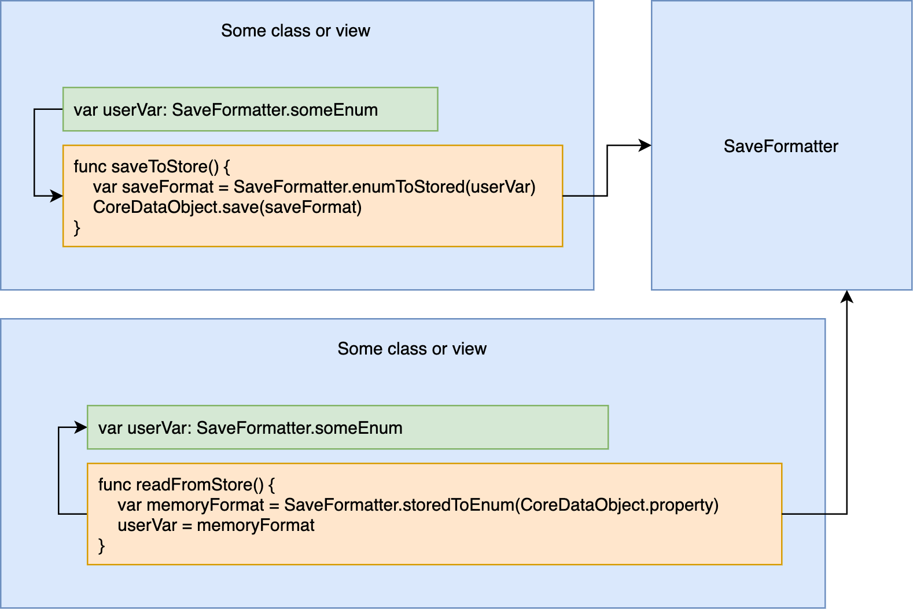

Given Mu's usage of both UIKit and SwiftUI facilities, Mu's architecture cannot be characterized as strictly MVC or MVVM. This document details the development guidelines that Mu uses when managing model and view objects.

1. [SaveFormatter](#saveformatter)

# SaveFormatter
Mu implements `SaveFormatter`, which defines enums, structs, and APIs to be used when converting data between persistent storage and memory. Mu expects Views using values that will eventually be saved to persistent storage to use instances of enums/structs defined in `SaveFormatter`.  

For each type that is defined in `SaveFormatter`, APIs must be implemented that provide the following functionality:  
* Convert data from persistent store form to enum/struct to use in-memory (`storedTo*()` functions).
* Convert in-memory enum/struct to persistent store save form (`*toStored()` functions).
* (As needed) Convert the enum/struct to different formats for UI to present.

The following figure illustrates the intended usage of `SaveFormatter` in converting data between persistent store and memory.
